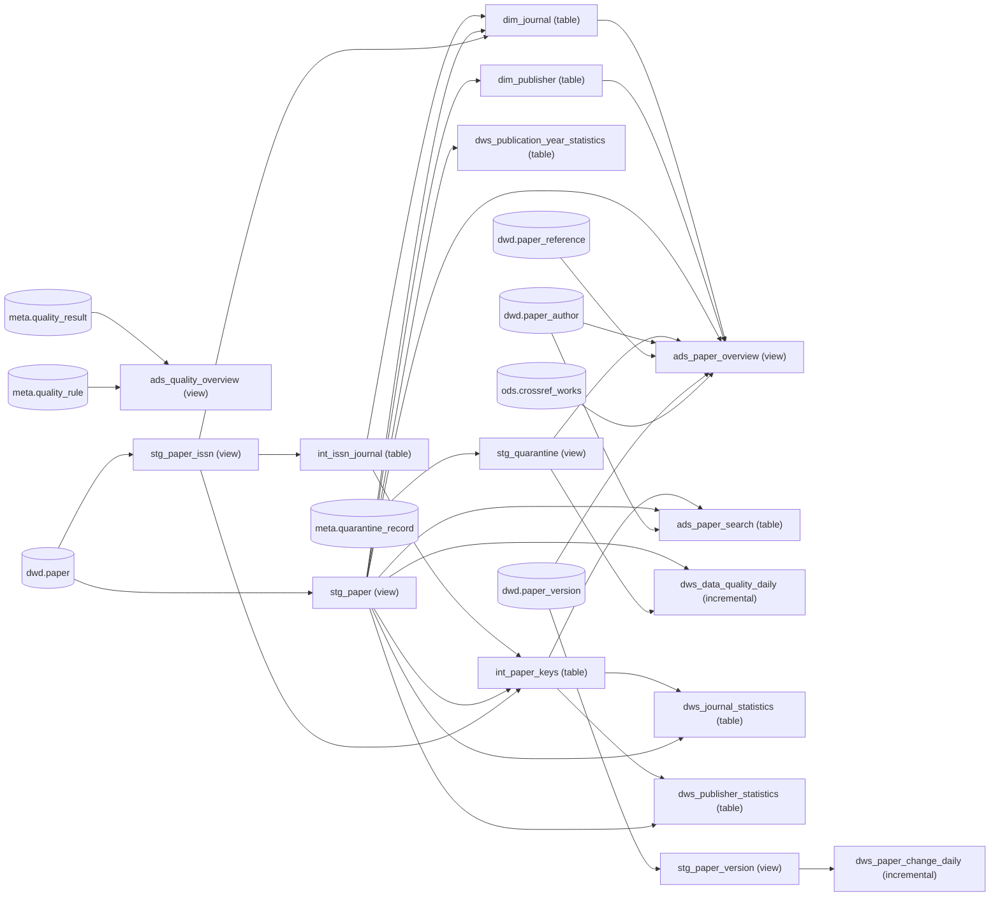

# dbt model DAG

Generated from `dbt/target/manifest.json` (17 models, 10 sources). Do not edit by hand: `python scripts/dbt_dag.py`.

```mermaid
flowchart LR
  model_paperforge_ads_paper_overview["ads_paper_overview (view)"]
  model_paperforge_ads_paper_search["ads_paper_search (table)"]
  model_paperforge_ads_quality_overview["ads_quality_overview (view)"]
  model_paperforge_dim_journal["dim_journal (table)"]
  model_paperforge_dim_publisher["dim_publisher (table)"]
  model_paperforge_dws_data_quality_daily["dws_data_quality_daily (incremental)"]
  model_paperforge_dws_journal_statistics["dws_journal_statistics (table)"]
  model_paperforge_dws_paper_change_daily["dws_paper_change_daily (incremental)"]
  model_paperforge_dws_publication_year_statistics["dws_publication_year_statistics (table)"]
  model_paperforge_dws_publisher_statistics["dws_publisher_statistics (table)"]
  model_paperforge_int_issn_journal["int_issn_journal (table)"]
  model_paperforge_int_paper_keys["int_paper_keys (table)"]
  model_paperforge_stg_paper["stg_paper (view)"]
  model_paperforge_stg_paper_issn["stg_paper_issn (view)"]
  model_paperforge_stg_paper_version["stg_paper_version (view)"]
  model_paperforge_stg_quarantine["stg_quarantine (view)"]
  source_paperforge_dwd_paper[("dwd.paper")]
  source_paperforge_dwd_paper_author[("dwd.paper_author")]
  source_paperforge_dwd_paper_reference[("dwd.paper_reference")]
  source_paperforge_dwd_paper_version[("dwd.paper_version")]
  source_paperforge_meta_quality_result[("meta.quality_result")]
  source_paperforge_meta_quality_rule[("meta.quality_rule")]
  source_paperforge_meta_quarantine_record[("meta.quarantine_record")]
  source_paperforge_ods_crossref_works[("ods.crossref_works")]
  model_paperforge_dim_journal --> model_paperforge_ads_paper_overview
  model_paperforge_dim_publisher --> model_paperforge_ads_paper_overview
  model_paperforge_int_issn_journal --> model_paperforge_dim_journal
  model_paperforge_int_issn_journal --> model_paperforge_int_paper_keys
  model_paperforge_int_paper_keys --> model_paperforge_ads_paper_search
  model_paperforge_int_paper_keys --> model_paperforge_dws_journal_statistics
  model_paperforge_int_paper_keys --> model_paperforge_dws_publisher_statistics
  model_paperforge_stg_paper --> model_paperforge_ads_paper_overview
  model_paperforge_stg_paper --> model_paperforge_ads_paper_search
  model_paperforge_stg_paper --> model_paperforge_dim_journal
  model_paperforge_stg_paper --> model_paperforge_dim_publisher
  model_paperforge_stg_paper --> model_paperforge_dws_data_quality_daily
  model_paperforge_stg_paper --> model_paperforge_dws_journal_statistics
  model_paperforge_stg_paper --> model_paperforge_dws_publication_year_statistics
  model_paperforge_stg_paper --> model_paperforge_dws_publisher_statistics
  model_paperforge_stg_paper --> model_paperforge_int_paper_keys
  model_paperforge_stg_paper_issn --> model_paperforge_dim_journal
  model_paperforge_stg_paper_issn --> model_paperforge_int_issn_journal
  model_paperforge_stg_paper_issn --> model_paperforge_int_paper_keys
  model_paperforge_stg_paper_version --> model_paperforge_dws_paper_change_daily
  model_paperforge_stg_quarantine --> model_paperforge_ads_paper_overview
  model_paperforge_stg_quarantine --> model_paperforge_dws_data_quality_daily
  source_paperforge_dwd_paper --> model_paperforge_stg_paper
  source_paperforge_dwd_paper --> model_paperforge_stg_paper_issn
  source_paperforge_dwd_paper_author --> model_paperforge_ads_paper_overview
  source_paperforge_dwd_paper_author --> model_paperforge_ads_paper_search
  source_paperforge_dwd_paper_reference --> model_paperforge_ads_paper_overview
  source_paperforge_dwd_paper_version --> model_paperforge_ads_paper_overview
  source_paperforge_dwd_paper_version --> model_paperforge_stg_paper_version
  source_paperforge_meta_quality_result --> model_paperforge_ads_quality_overview
  source_paperforge_meta_quality_rule --> model_paperforge_ads_quality_overview
  source_paperforge_meta_quarantine_record --> model_paperforge_stg_quarantine
  source_paperforge_ods_crossref_works --> model_paperforge_ads_paper_overview
```
